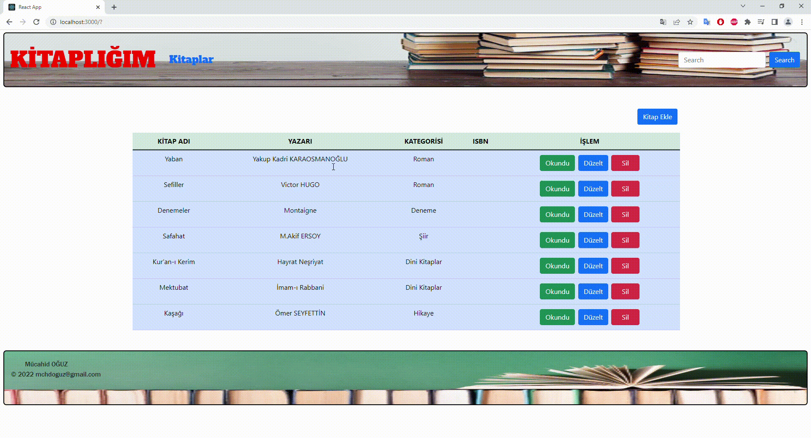

# Kitaplık Projesi

Kitap ekleme, silme ve okundu olarak işaretle yapılacak şekilde bir kitaplık uygulaması tasarlanmıştır.

## Kullanılan İçerikler

HTML, CSS, JS, React

### Proje Özeti

JSON Server üzerinden bir backend veritabanı oluşturularak gerçek bir veritabanı ile çalışma ortamı sağlanmıştır.

COMPONENTS klasörü oluşturulak içerisine
Header
Footer
Kitap Listesi
Kitap Ekleme
bölümleri yapılarak projeye entegre edilmiştir.

PAGES klasörü oluşturularak içerisine
Kitap Ekleme
Ana Sayfa
gibi sayfalar oluşturularak projeye entegre edilmiştir.

CSS olarak BOOSTRAP kütüphanesi kullanımıştır. Ayrıca bazı bölümler için de harici bir CSS STYLE dosyası kullanılmıştır.

AXIOS Kütüphanesi kullanılmıştır.

<h2> gif eklendi </h2>

## Proje geliştirmeleri devam etmektedir...